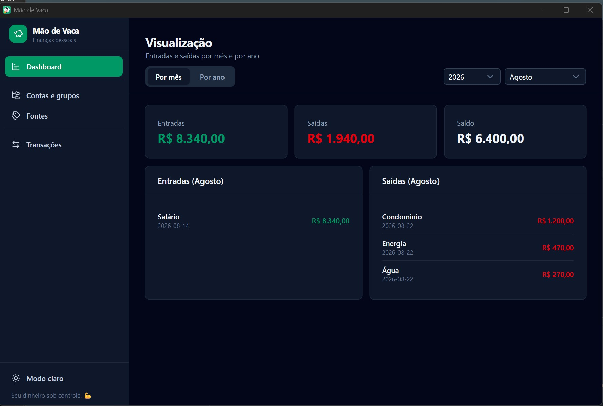
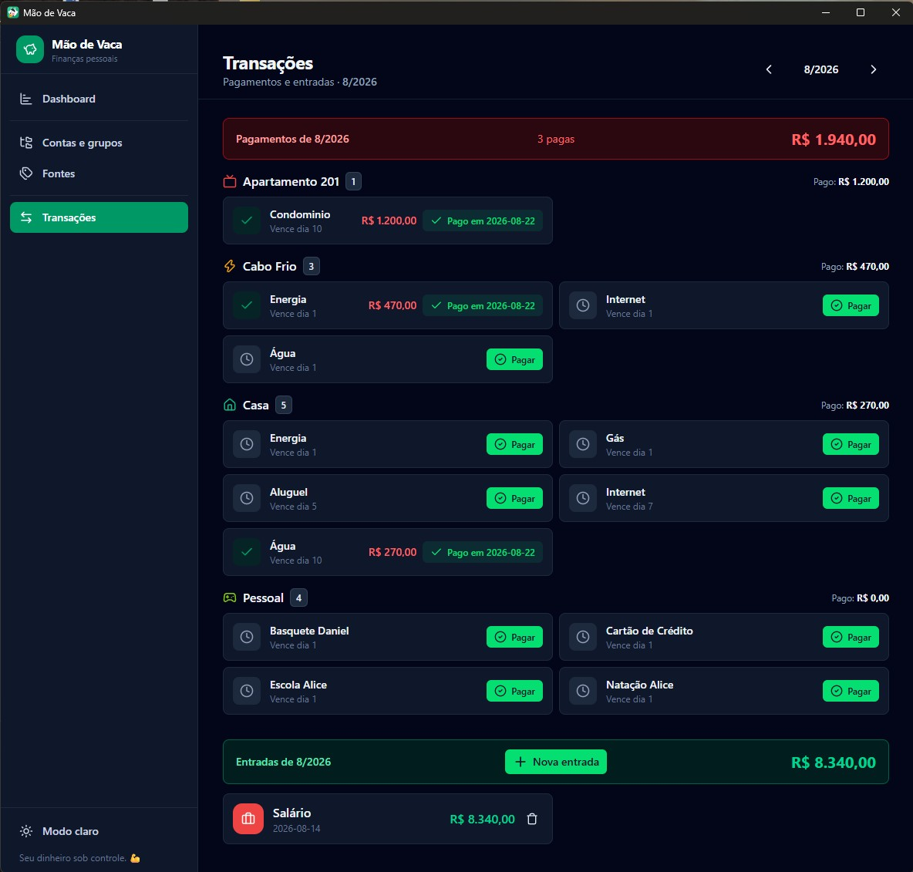

[Support me](https://donatr.ee/pedrofaria)

<!-- GitHub badge -->
[](https://donatr.ee/pedrofaria)

# Mão de Vaca 🐄

**Finanças pessoais direto na sua máquina** — app desktop que acompanha suas contas a pagar
recorrentes, entradas de crédito e o fechamento do mês, com tudo armazenado localmente.

<p align="center">
  
</p>

Construído com [Wails](https://wails.io) (Go + WebView2) e [Nuxt UI](https://ui.nuxt.com) (Vue 3).

---

## ✨ Funcionalidades

- **Contas a pagar recorrentes** — cadastre suas despesas fixas (aluguel, condomínio, assinaturas,
  mercado...) organizadas em **grupos** (Casa, Cabo Frio, Pessoal...), com dois **tipos de conta**:
  **Fixo** (valor e dia de vencimento) ou **Percentual** (valor calculado a partir das entradas)
- **Pagamentos mês a mês** — marque o que já foi pago no mês, com valor e data reais; desfaça quando
  precisar
- **Fontes de crédito** — cadastre suas entradas recorrentes (salário, aluguéis) com ícone e cor
- **Entradas** — lance créditos no mês, com descrição opcional
- **Dashboard** — resumo do mês: entradas, despesas pagas e saldo de um relance
- **Relatórios** — visão mensal e anual do fluxo de caixa
- **Dark mode** 🌙 — tema claro/escuro
- **100% local** — seus dados nunca saem da sua máquina (SQLite)

### Tipos de conta

Ao criar/editar uma conta você escolhe o **tipo**:

- **Fixo** — valor fixo com dia de vencimento (ex.: aluguel, internet, condomínio).
- **Percentual** — o valor é calculado automaticamente como uma **porcentagem da soma das
  entradas** de uma ou mais **fontes** no mês. Ex.: uma conta *Dízimo* com `10%` da fonte
  *Salário*. Na tela de **Transações**, o app já mostra o valor sugerido do mês e o pré-preenche
  ao pagar (ajustável antes de confirmar).

---

## 📸 Screenshots

<p align="center">
  
  <br>
  <em>Dashboard — resumo do mês</em>
</p>

<p align="center">
  
  <br>
  <em>Transações — pagar contas e lançar entradas</em>
</p>

## 🛠️ Tecnologias

| Camada | Stack |
|---|---|
| Shell | [Wails v2](https://wails.io) (Go 1.25) |
| Banco de dados | SQLite puro-Go ([modernc.org/sqlite](https://modernc.org/sqlite)) — sem CGO |
| Frontend | Vue 3 + Vite + TypeScript |
| UI | [Nuxt UI v4](https://ui.nuxt.com) + Tailwind CSS 4 |
| Rotas | vue-router (hash mode) |

## 📦 Requisitos

- Go 1.25+
- Node.js 20+ (frontend)
- [Wails CLI v2](https://wails.io/docs/gettingstarted/installation)
- Windows 10/11 com WebView2 (pré-instalado no Windows 11)

## 🚀 Rodando em desenvolvimento

```bash
wails dev
```

Isso sobe o Vite com **hot reload** (frontend + backend). Para desenvolver no navegador e chamar
os métodos Go pelo devtools, acesse `http://localhost:34115`.

## 🔨 Build de produção

```bash
wails build
```

Gera o executável em `build/bin/`.

## 🗂️ Estrutura

```
maodevaca/
├── app.go            # Handlers do backend (grupos, contas, pagamentos)
├── incomes.go        # Fontes e entradas de crédito
├── reports.go        # Agregações mensais/anuais
├── db.go             # Inicialização do SQLite e schema
├── models.go         # Structs do domínio
└── frontend/
    ├── src/views/    # Dashboard, Contas, Transações, Fontes, Relatórios
    ├── src/lib/      # api (bridge), format, state, types
    └── src/router.ts # Rotas
```

## 💾 Dados

O banco SQLite fica em `%APPDATA%\maodevaca\maodevaca.db` — sem conta, sem nuvem, sem sincronização.

## 📄 Licença

[MIT](LICENSE) © 2026 Pedro Faria
